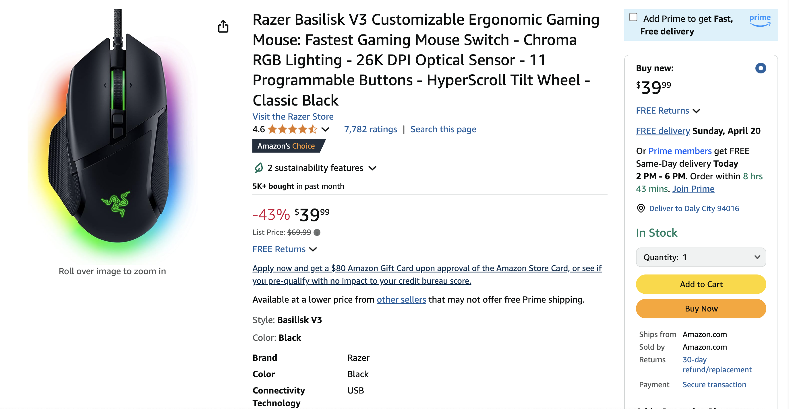

# MCP Server for Amazon web scraping

In this setup, the host (Claude Desktop or Cursor IDE) spawns an MCP client, which then connects to an external MCP server. That server exposes tools, resources, and prompts, allowing the AI to interact with them as needed.

In short, the workflow operates as follows:

- The user sends a message like "Fetch product info from this Amazon link."
- The MCP client checks for a registered tool that can handle that task
- The client sends a structured request to the MCP server
- The MCP server executes the appropriate action (e.g., launching a headless browser)
- The server returns structured results to the MCP client
- The client forwards the results to the LLM, which presents them to the user

## Developing Your Own MCP Server
This projects is about Python MCP server that extract data from Amazon product pages.


This server  offer two tools: 
- `fetch_page`: to download HTML 
- `extract_info`: extract organized information. 
You'll interact with the server via an LLM client in Cursor or Claude Desktop.

### Install
Install the necessary libraries: 
 - [MCP Python SDK](https://github.com/modelcontextprotocol/python-sdk): Python SDK for Model Context Protocol servers and clients that handles all the JSON-RPC communication details
 - [Playwright](https://playwright.dev/python/): Browser automation library that provides headless browser capabilities for rendering and scraping JavaScript-heavy websites
 - [LXML](https://lxml.de/): Fast XML/HTML parsing library that makes it easy to extract specific data elements from web pages using XPath queries

 ```bash
 uv add playwright lxml
 ```
In short, the MCP Python SDK (mcp) handles all protocol details, letting you expose tools that Claude or Cursor can call via natural-language prompts. Playwright allows us to render web pages completely (including JavaScript content), and lxml gives us powerful HTML parsing capabilities.

Install playwright
```bash
playwright install
```

---
## Usage
### Connect to your MCP Server

You can use Clause, or other clients such as [Cursor AI](https://www.augmentcode.com).  
We will be using VS Code MCP Servers which is currently in preview.  MCP support in agent mode in VS Code is available starting from VS Code 1.99 and is currently in preview.
See [VS Code MCP Server](https://code.visualstudio.com/docs/copilot/chat/mcp-servers) for more information.
To enable MCP support in VS Code, enable the `chat.mcp.enabled` setting.


Create a `.vscode/mcp.json` file in your workspace.

And enter:
```json
{
  "servers": {
    "amazon_product_scraper": {
      "command": "python",  // Or python3 if needed
      "args": ["/full/path/to/your/amazon_scraper_mcp.py"], // <-- IMPORTANT: Use the correct absolute path
    }
  }
}
```

In my case:
```json
{
  "servers": {
    "amazon_product_scraper": {
      "command": "python3",
      "args": ["/Users/Fab/Git/salesintel/research-agent/projects/web-scrap-amazon/server_amazon_scraper.py"],
    }
  }
}
```

Select the Add Server button to add a template for a new server. VS Code provides IntelliSense for the MCP server configuration file.

Alternatively, run the MCP: Add Server command from the Command Palette, choose the type of MCP server to add and provide the server information. Next, select Workspace Settings to create the .vscode/mcp.json file in your workspace if it doesn't already exist.

### Alternative to VSCode or Claude for connecting to MCP Server
Run the server in one terminal:
```bash
python3 server_amazon_scraper.py
```

Example:
```bash
$ python3 server_amazon_scraper.py
MCP Server Initialized: Amazon Product Scraper
Starting MCP Server with stdio transport...
```

And run the client app in another:
```bash
python3 client_amazon_scraper.py
```

Example:
```bash
$ python3 client_amazon_scraper.py
[05/25/25 17:01:36] INFO     Processing request of type ListToolsRequest                                                      server.py:551

Connected to server with tools:
  - fetch_page:
    Fetches the HTML content of the given Amazon product URL using Playwright
    and saves it to a temporary file. Returns a status message.

  - extract_info:
    Parses the saved HTML file (downloaded by fetch_page) to extract
    Amazon product details like title, price, rating, features, etc.
    Returns a dictionary of the extracted data.
```


You should also see the MCP server interaction with amazon.com based on our query
```json
Query: Extract all available product data from this Amazon URL: https://www.amazon.com/dp/B09C13PZX7. Format the output as a structured JSON object.
                    INFO     Processing request of type ListToolsRequest                                                      server.py:551
[05/25/25 17:01:37] INFO     Processing request of type CallToolRequest                                                       server.py:551

result: HTML content for https://www.amazon.com/dp/B09C13PZX7 downloaded and saved successfully to /tmp/amazon_product_page.html.
[05/25/25 17:01:48] INFO     Processing request of type CallToolRequest                                                       server.py:551

result: {
  "title": "Razer Basilisk V3 Customizable Ergonomic Gaming Mouse: Fastest Gaming Mouse Switch - Chroma RGB Lighting - 26K DPI Optical Sensor - 11 Programmable Buttons - HyperScroll Tilt Wheel - Classic Black",
  "price": 4499.0,
  "original_price": 6999.0,
  "discount_percent": 36,
  "rating_stars": null,
  "review_count": 7930,
  "features": [
    "ICONIC ERGONOMIC DESIGN WITH THUMB REST — PC gaming mouse favored by millions worldwide with a form factor that perfectly supports the hand while its buttons are optimally positioned for quick and easy access",
    "11 PROGRAMMABLE BUTTONS — Assign macros and secondary functions across 11 programmable buttons to execute essential actions like push-to-talk, ping, and more",
    "HYPERSCROLL TILT WHEEL — Speed through content with a scroll wheel that free-spins until its stopped or switch to tactile mode for more precision and satisfying feedback that’s ideal for cycling through weapons or skills",
    "11 RAZER CHROMA RGB LIGHTING ZONES — Customize each zone from over 16.8 million colors and countless lighting effects, all while it reacts dynamically with over 150 Chroma integrated games",
    "OPTICAL MOUSE SWITCHES GEN 2 — With zero unintended misclicks these switches provide crisp, responsive execution at a blistering 0.2ms actuation speed for up to 70 million clicks",
    "FOCUS+ 26K DPI OPTICAL SENSOR — Best-in-class mouse sensor with intelligent functions flawlessly tracks movement with zero smoothing, allowing for crisp response and pixel-precise accuracy",
    "#1 SELLING PC GAMING PERIPHERALS BRAND IN THE U.S. — Source — Circana, Retail Tracking Service, U.S., Dollar Sales, Gaming Designed Mice, Keyboards, and PC Headsets, Jan. 2019- Dec. 2023 combined",
    "OPTIMIZE MOUSE ACCURACY — Improve accuracy by disabling the \"Enhance pointer precision\" option in the Windows mouse settings, and further optimize performance using the Razer Synapse App"
  ],
  "availability": "N/A"
}
```

You should see the page extracted
```json
Response: ```json
{
    "title": "Razer Basilisk V3 Customizable Ergonomic Gaming Mouse: Fastest Gaming Mouse Switch - Chroma RGB Lighting - 26K DPI Optical Sensor - 11 Programmable Buttons - HyperScroll Tilt Wheel - Classic Black",
    "price": 44.99,
    "original_price": 69.99,
    "discount_percent": 36,
    "rating_stars": null,
    "review_count": 7930,
    "features": [
        "ICONIC ERGONOMIC DESIGN WITH THUMB REST — PC gaming mouse favored by millions worldwide with a form factor that perfectly supports the hand while its buttons are optimally positioned for quick and easy access",
        "11 PROGRAMMABLE BUTTONS — Assign macros and secondary functions across 11 programmable buttons to execute essential actions like push-to-talk, ping, and more",
        "HYPERSCROLL TILT WHEEL — Speed through content with a scroll wheel that free-spins until its stopped or switch to tactile mode for more precision and satisfying feedback that’s ideal for cycling through weapons or skills",
        "11 RAZER CHROMA RGB LIGHTING ZONES — Customize each zone from over 16.8 million colors and countless lighting effects, all while it reacts dynamically with over 150 Chroma integrated games",
        "OPTICAL MOUSE SWITCHES GEN 2 — With zero unintended misclicks these switches provide crisp, responsive execution at a blistering 0.2ms actuation speed for up to 70 million clicks",
        "FOCUS+ 26K DPI OPTICAL SENSOR — Best-in-class mouse sensor with intelligent functions flawlessly tracks movement with zero smoothing, allowing for crisp response and pixel-precise accuracy",
        "#1 SELLING PC GAMING PERIPHERALS BRAND IN THE U.S. — Source — Circana, Retail Tracking Service, U.S., Dollar Sales, Gaming Designed Mice, Keyboards, and PC Headsets, Jan. 2019- Dec. 2023 combined",
        "OPTIMIZE MOUSE ACCURACY — Improve accuracy by disabling the \"Enhance pointer precision\" option in the Windows mouse settings, and further optimize performance using the Razer Synapse App"
    ],
    "availability": "N/A"
}
```

### Resources
 - [web scraping with mcp](https://github.com/luminati-io/web-scraping-with-mcp)